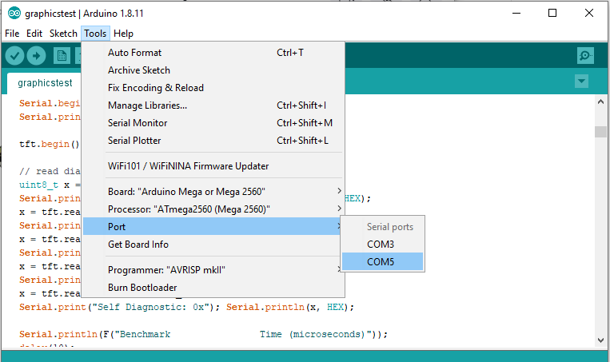

# Quick Start

## Arduino IDE

**Arduino** is an open-source electronics prototyping platform
It is in the Approved Freeware List: https://kb.epam.com/display/EPMSAM/Approved+Freeware

Arduino source:  https://github.com/arduino/Arduino/

Download a binary install file for your OS : https://www.arduino.cc/en/Main/Software

#### Windows
1. Download Windows ZIP file for non admin install: **arduino-x.x.xx-windows.zip**
2. Unzip it in C:\Users\YOUR_USER\arduino 2
3. Download ZIP files of Adafruit libraries for TFT displays:
   * **Adafruit_ILI9340** : https://github.com/adafruit/Adafruit_ILI9340
   * **Adafruit_ILI9341** : https://github.com/adafruit/Adafruit_ILI9341
   * **Adafruit-GFX-Library** : https://github.com/adafruit/Adafruit-GFX-Library
3. Open libraries folder c:\Users\YOUR_USER\arduino\arduino-1.8.11\libraries\
4. Unzip and copy there AdaFruit libraries (remove "master" from the names):
   * Adafruit_ILI9340
   * Adafruit_ILI9341
   * Adafruit-GFX-Library
5. Start c:\Users\YOUR_USER\arduino\arduino-1.8.11\arduino.exe (allow firewall)
6. Open an example project file in the Adafruit_ILI9341: 
   c:\arduino\arduino-1.8.11\libraries\Adafruit_ILI9341\examples\graphicstest\graphicstest.ino
7. Connect Arduino board USB to computer, the driver should be installed successfully. If not we will provide some clue in FAQ.
8. Choose board type and processor type if necessary in menu Tools.

9. Choose proper Port in Tools (for example: COM3)
10. Compile and load the example. You should see test pictures on TFT display.

